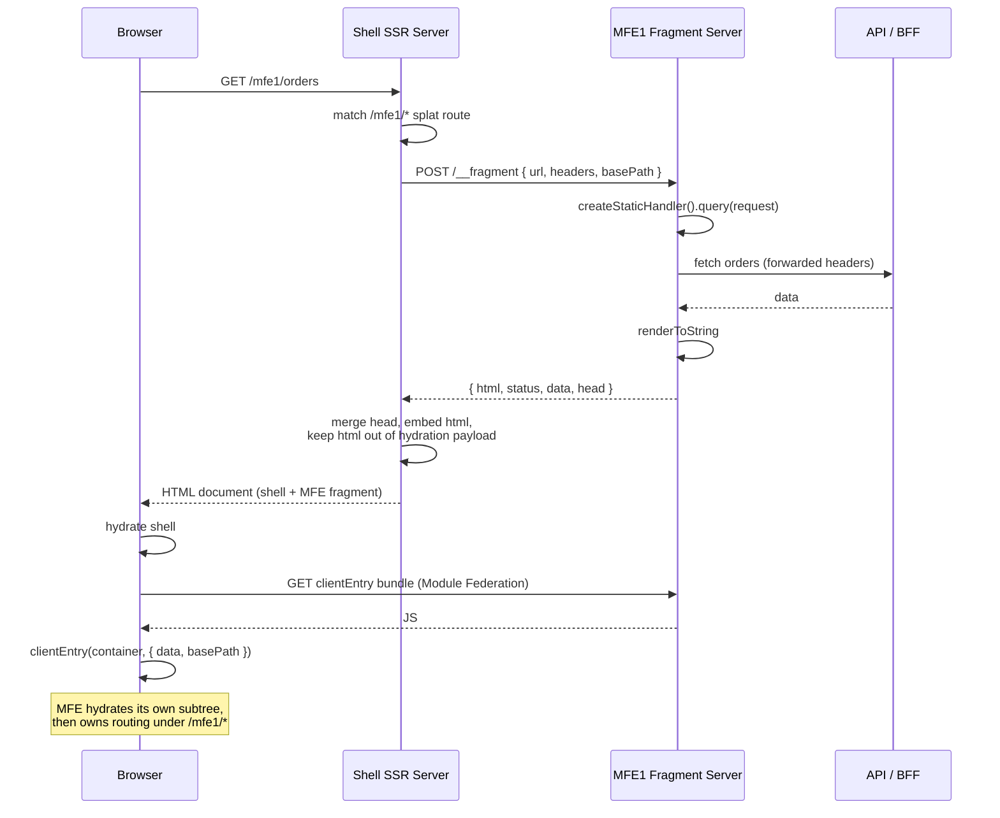

# MFE SSR — Architecture Decision Record & PoC Findings

**Date:** 2026-09-16
**Status:** Implemented and verified end-to-end in this repo — server render,
SEO output, fail-soft, **and browser hydration**.
**Supersedes:** `library-framework-decision.md`, `mfe-ssr-poc-synthesis.md`,
`per-mfe-server-variant.md` (all consolidated here).
**Amends:** the original `tanstack-start-mfe-ssr-architecture.md` — see
*Divergence* (§5). That file is no longer present in this repo; §5 records what
it specified and where the implementation departs from it.

---

## 1. Summary

A shell application owns the document and is server-rendered for SEO. Each
micro-frontend is an independently deployed service that renders **HTML
fragments** on request. The shell fetches those fragments over HTTP during its
own SSR, embeds them, and after hydration hands each mount point to the MFE's
own client bundle, which takes over routing beneath its mount path.

```
Browser
   │
   ▼
┌─────────────────────────────┐        POST /__fragment
│  Shell (React Router FW)    │ ──────────────────────────►  MFE1 fragment server
│  • owns the document        │ ◄──────────────────────────  { html, status, data, head }
│  • only SEO-bearing SSR     │        (own process)
│  • splat route /mfe1/*      │
└─────────────────────────────┘ ──────────────────────────►  MFE2, MFE3 …
   │
   │  browser: Module Federation (dependency sharing only)
   ▼
MFE1 clientEntry ── hydrates its own subtree, owns routing under /mfe1/*
```

**The contract, unchanged across every variant we tested:**

```
{ url, headers, basePath }  →  { html, status, data, head }
```

### What has been verified

| | |
| --- | --- |
| Crawler-visible SSR, index **and** deep links | ✅ raw HTML carries real content |
| MFE `<title>` merged into the shell's `<head>` | ✅ |
| Loader data resolved server-side | ✅ |
| Browser hydration + `loadRemote` + MFE mount | ✅ |
| Client-side navigation *inside* the MFE | ✅ no page reload |
| Fail-soft: MFE down → degraded fragment, shell alive | ✅ 200, recovers unaided |
| Server bundle absent from the public client output | ✅ enforced at build |

---

## 2. Why this architecture

This section is the point of the document. Each decision below was forced by
something we hit, not chosen on preference.

### 2.1 Exactly one thing can own the document

An HTML document has one `<html>`, one `<head>`, one hydration lifecycle. That
single fact drives everything else: the shell owns the document, and MFEs
contribute **fragments** into it.

### 2.2 Therefore an MFE cannot be a full SSR framework

A framework that owns the document assumes it is alone on the page. Concretely:

- TanStack Start emits complete documents — `<!DOCTYPE html>` wrapping, plus
  hydration scripts injected before `</body>`. There is no fragment contract, so
  embedding one means scraping a document.
- Frameworks hydrate through a single document-level global. Start's is `$_TSR`
  — hardcoded, and deleted once hydration completes. Two such apps on one page
  contend over it.

**This holds whether or not the MFE has a server.** The collision is in the
browser, and servers do not change the browser. It is the one constraint that
survived every change of approach.

### 2.3 Therefore MFEs use React Router in *library* mode

We tested the alternative. TanStack Router without Start produced `matches: []`
and an **empty HTML string**: its SSR path needs a bootstrap sequence
(`attachRouterServerSsrUtils` → `load()` → `serverSsr.dehydrate()`) whose methods
are annotated `/** Framework-only. */` in the library's own source. Finishing
that by hand means privately reimplementing Start's server handler against
internals with no stability guarantee — and it drags `$_TSR` back in.

React Router's `createStaticHandler` / `createStaticRouter` /
`StaticRouterProvider` exist precisely to be driven by an arbitrary host. With
`hydrate={false}`, hydration data is passed explicitly as plain values and no
document-level global is involved.

**Why library mode and not React Router framework mode for MFEs:** framework
mode is also a document-owning framework, so §2.2 applies to it equally.

### 2.4 Therefore MFEs own their servers

Originally the shell loaded MFE code into its own process via server-side
Module Federation. It worked, but every hard failure in the PoC traced to that
one design choice:

| Failure | Root cause |
| --- | --- |
| Every shell route 500'd with `__webpack_modules__[moduleId] is not a function` | The MF plugin rewrites the host environment to `chunkLoading: 'async-node'`, breaking the shell framework's own chunk loading |
| Shell **process died** when an MFE was unreachable | MF's `SnapshotHandler` rejects an internal floating promise; Node terminates on unhandled rejection. A process-level guard was added at the time and later **removed** — with MFEs behind HTTP a failed `fetch` is an ordinary rejected promise, caught at the call site |
| MFE edits required restarting the shell | Remote containers are cached in-process |
| Cross-request state, shared globals, shared memory, shared crash blast radius | Another team's code executing in your process |
| `--experimental-vm-modules`, a static server for the node build, `assetPrefix` juggling, a separate federation compilation | Consequences of loading remote code into the server |

All of it is one problem wearing different hats: **executing another team's code
inside your server process.** Moving MFEs behind HTTP removes the entire class.
A failed fetch is an ordinary rejected promise.

The cost is real — N services to operate, a network hop inside SSR — and that is
the trade this architecture accepts deliberately.

### 2.5 "Owns a server" does not mean "needs a framework"

The MFE's server has one job: accept a request, return `{ html, status, data, head }`.
The function already existed, so the server is a thin wrapper around it — Node's
built-in `http`, no framework, no new dependency. The MFE got *simpler* when it
gained a server.

This also removes the "you'd have to scrape HTML out of a document" objection:
the fragment endpoint is designed on purpose rather than parsed after the fact.

### 2.6 Module Federation is kept — but only in the browser

Server-side federation is what caused the damage above. Client-side federation
is well-supported and earns its place: it keeps `react`, `react-dom` and
`react-router` as shared singletons, so the page carries one copy of each rather
than one per MFE.

### 2.7 The shell is React Router framework mode

With MFEs on React Router library mode, a React Router shell makes
`react-router` a genuine singleton across shell and MFEs. TanStack Start would
mean shipping two router libraries with no way to dedupe them.

**On the bundler.** The shell runs on rsbuild because *server-side* Module
Federation only works properly on rspack. That original constraint is gone — we
removed server-side federation in §2.4 — so moving to React Router's first-party
Vite plugin, and off a pre-1.0 community plugin, is worth periodically
re-examining. It is a bigger move than it first appears.

Reading the plugin's source, `pluginReactRouter({ federation: true })` performs
three fixes, all in rspack's own model:

| `src/federation.ts` | What it prevents |
| --- | --- |
| `isolateFederationContainerRuntime` | Gives the MF container its own runtime chunk. Sharing one means the app entry's share-scope consumes run before the host initialises the scope — **a second React**. |
| `ensureFederationAsyncStartup` | Force-sets `asyncStartup` on the MF plugin, the async boundary shared consumption needs (see §8). |
| `enforceAsyncOnlyServerSplitChunks` | Pins `splitChunks.chunks = 'async'` so initial chunks cannot break rspack's startup gate `__webpack_require__.O`. |

`runtimeChunk`, `splitChunks` and `__webpack_require__.O` are webpack-lineage
concepts with no Vite counterpart, so this is not code to port — the failure
modes differ. On Vite the browser half would run on `@module-federation/vite`,
the package rejected in §4 path 6, scoped to the client environment only. That
scoping is plausible under Vite's environment API but **untested here**.

Worth weighing: "official plugin" buys React Router stability at the cost of
Module Federation stability, and every hard problem in this project has come
from the federation side. Recommendation: stay on rsbuild until the plugin's
pre-1.0 status causes a concrete problem; if it does, spike the Vite shell in a
throwaway directory before committing.

---

## 3. The implemented system

### Components

| Project | Role | Ports |
| --- | --- | --- |
| `ssr-shell-rt` | Shell. React Router framework mode on rsbuild. Owns the document and URL space. | 3000 |
| `ssr-mfe` | MFE1. React Router library mode + fragment server. | 3001 browser bundle, 3002 fragment server |

### MFE endpoints

| Endpoint | Purpose |
| --- | --- |
| `POST /__fragment` | The contract. `{url, headers, basePath}` → `{html, status, data, head}` |
| `GET /preview/*` | SSR + hydrate preview — the shell's render path without the shell: server markup plus loader data, hydrated by the :3001 bundle |
| `GET /health` | Liveness |

### How each half of the contract is typed

Both halves come from one package, `@platform/mfe-contract` (`mfe-contract/`
in this repo, a `file:` dependency standing in for a registry package). The
contract is the platform's, not MFE1's: every MFE implements the same shape,
and only `data` varies, hence a type parameter.

- **Compile time.** The MFE implements the types (`satisfies ClientEntryModule`),
  the shell imports them. A change one side doesn't expect fails that side's
  build.
- **Runtime.** Shell and MFEs deploy independently, so compiling against the
  same types says nothing about what is running. Each side reports the
  `CONTRACT_VERSION` it was built against — in `FragmentResponse` and as an
  export of the `clientEntry` module — and the shell checks it before use. A
  mismatched fragment is treated like any failure (client rendering); a
  mismatched browser bundle isn't mounted, leaving server markup static.
  Verified in a browser by bumping each side's version in turn.

Why not MF's generated types: its DTS plugin needs either a build-time
`remotes` declaration, which bakes the URL in (§2.7), or its dev-only runtime
hook (`dynamic-remote-type-hints-plugin`), which fetches types only after a
browser registers the remote — never in CI. And it could only ever cover the
browser half: `/__fragment` is JSON, not a module.

### Request sequence



### Ownership boundary

- **Shell owns** the document, the URL space, which path each MFE occupies, and
  `<head>` composition.
- **MFE owns** everything beneath its mount path: routes, navigation, data
  fetching, and its own rendering.

`basePath` is passed in rather than hardcoded, so an MFE can be relocated or
mounted more than once without an MFE release.

### Resilience

The shell treats an MFE as a fragment, never as the page:

- Per-MFE timeout via `AbortSignal.timeout` — genuinely cancels the request.
- Any failure or non-2xx degrades that fragment to client-side rendering; the
  page still renders.
- No process-level guard. One was needed while MFE code ran in the shell's
  process (§2.4) and was removed with it: behind HTTP, a failed fetch is an
  ordinary rejected promise caught at its call site.

**Verified:** with the MFE server down, `/mfe1` returns 200 with a degraded
fragment, the shell stays alive across repeated requests, and it recovers
automatically when the MFE returns — no restart.

---

## 4. How we got here — paths tested

| # | Path | Result | Evidence |
| --- | --- | --- | --- |
| 1 | MF attached to the shell framework's own SSR environment | ❌ | Every route 500s inside the framework's own `loadEntries()` |
| 2 | MF in a separate compilation, loaded via runtime `require` | ✅ worked | Needed 6 permanent workarounds |
| 3 | MFE on TanStack Router, no Start | ❌ | `matches: []`, empty HTML |
| 4 | MFE on React Router library mode | ✅ | Full SSR + loader data; **zero shell changes required** |
| 5 | MFE on TanStack Start | ⛔ reasoned | §2.2 — owns the document |
| 6 | Vite instead of rsbuild | ⛔ researched | `@module-federation/vite` is CSR-oriented with documented SSR incompatibilities |
| 7 | Shell on React Router framework mode | ✅ | MF attaches directly to its `node` env; no separate compilation |
| 8 | **MFEs own their servers** | ✅ **adopted** | Eliminated every failure in §2.4 |

Notable negative result: `experiments.asyncStartup: true` did **not** fix path 1,
with or without eager sharing — it addresses share-scope timing, not chunk
loading. Recorded so nobody repeats it.

Path 4 proved the contract is router-agnostic: swapping the MFE's router
required no shell change at all. That property is what later made the transport
swap in path 8 cheap.

---

## 5. Divergence from the original architecture doc

`tanstack-start-mfe-ssr-architecture.md` should be amended. Four of its
statements no longer hold:

| Original | Now |
| --- | --- |
| "One SSR server" | Shell + one server per SSR-capable MFE |
| "No route-level reverse proxy between applications" | The shell fetches fragments over HTTP |
| **Rule 1:** no MFE-owned server | **Dropped.** MFEs own a fragment server — but still no MFE-owned *application* server, no `createServerFn`, no MFE-owned API routes |
| "Runtime Module Federation remains the MFE integration mechanism" | Browser only. Server integration is HTTP |

What survives unchanged: MFEs contain universal React; they reach backends only
through APIs/BFFs; code must be SSR-safe; React/React-DOM/router are shared
singletons in the browser; and the federation contract stays explicit — one shared, versioned contract
package for both halves (§3).

**One rule to add:** MFE server code must hold no mutable module-scope state.
The fragment server handles many requests in one process, so module-level
mutable state leaks across users.

---

## 6. Accepted trade-offs

- **Operational cost.** N services to deploy, monitor, scale and secure. This is
  the price of the isolation in §2.4.
- **Latency inside SSR.** Each fragment is a network round trip. Mitigated by
  per-MFE timeouts; parallelise when a page carries several MFEs.
- **Two router libraries would ship** if the shell ever moves to TanStack Start.
  Current choice avoids this.
- **Server-side dependency sharing does not exist** and is not needed — the
  server boundary is a serialized string, so instance identity never matters.

---

## 7. Known gaps

1. ~~Browser hydration is unverified.~~ **Closed.** Verified in a browser: the
   shell hydrates, `loadRemote` resolves, `clientEntry` hydrates the subtree
   without wiping the server markup, and navigation *inside* the MFE is
   client-side. The only hydration warning observed came from a browser
   extension (`cz-shortcut-listen` on `<body>`, ColorZilla), not the app.
2. **Version skew between server and browser.** Shell ↔ MFE skew is handled by
   the contract version check (§3). Still open: a deploy can leave one MFE's
   fragment server on one release while browsers load its previous client
   bundle — same contract major, different markup. Needs a deliberate strategy.
3. **Request context is minimal.** Only `headers` crosses today. Locale, user,
   tenant and feature flags will need an explicit, versioned slot — keep it
   small or it becomes a dumping ground.
4. **`validate:mfe` is unbuilt.** Should cover: no mutable module-scope state
   (a concurrency smoke test catches the realistic cases), no global mutation,
   SSR safety, and pinned versions.
5. **The shell's bundler.** Staying on rsbuild is a deliberate choice, not an
   inherited constraint — §2.7 sets out what a move to Vite would actually
   involve and what remains untested.

---

## 8. Operating notes

Node ≥ 22.22 (React Router 8); both projects pin 24.21.0 via `.nvmrc`.

```sh
cd ssr-mfe      && nvm use && npm run dev   # 3001 browser, 3002 fragment server
cd ssr-shell-rt && nvm use && npm run dev   # 3000
```

Gotchas discovered, all recorded in the project READMEs:

- `NODE_OPTIONS=--experimental-vm-modules` is required by **rsbuild's dev
  runner** for ESM server bundles — not, as first assumed, by Module Federation.
- **`experiments: { asyncStartup: true }` belongs on the *Module Federation
  plugin*, not on rsbuild's top-level `experiments`.** It is what wraps the entry
  in the async boundary shared consumption needs. `root.tsx` imports
  `react-router` at module scope, so without it the browser dies at startup with
  `RUNTIME-006: Invalid loadShareSync`. The symptom gives no hint which config
  object the option belongs on — it cost three wrong diagnoses (blaming
  `federation: false`, then `eager: true`, then reverting both).
- **`pluginReactRouter({ federation: true })` is startup wiring, not a
  build-output switch.** Turning it off to stop the server-bundle copy (below)
  breaks Module Federation before the app boots. Leave it on.
- **`federation: true` copies the whole server build into `build/client/static`**
  (`copySync(build/server, build/client/static)`, guarded on
  `pluginOptions.federation && ssr`). Served as a static origin, that publishes
  the shell's server bundle — verified byte-identical to `build/server/index.js`
  and fetchable over HTTP. `scripts/strip-server-copy.mjs` removes it after every
  build and fails if any file in `build/client` still hashes to the server
  bundle. Keep that check through plugin upgrades.
- **DTS type generation is off.** If re-enabled, `consumeTypes.abortOnError`
  must be `false`: the DTS watcher fetches remote manifests in the build tooling
  process, and on the default it takes the whole dev server down whenever an MFE
  is unreachable — a normal local state now that MFEs are separate services.
- The browser remote is loaded with `loadRemote('mfe1/clientEntry')` from
  `@module-federation/enhanced/runtime`, not a bare `import()`. The specifier is
  then a runtime string, so the server compilation has nothing to resolve. A
  static import instead requires marking it external on the node build, because
  the route component ships to both environments even though the call sits in a
  `useEffect` that never runs server-side.
- `@mf-types` must be in `tsconfig.json`'s `include` — that is what makes
  TypeScript pick up MF's module augmentation for `loadRemote`. It is generated,
  so it is also in `.gitignore`.
- `@react-router/dev`'s typegen imports Vite, so `vite` is a required
  devDependency even under rsbuild.
- React Router 8 renamed the `meta` argument from `data` to `loaderData` — found
  at runtime, as a silently missing `<title>`. Route modules now take their arg
  types from the plugin's generated `./+types/<route>` (`Route.LoaderArgs`,
  `Route.MetaArgs`), reachable via `rootDirs` in `tsconfig.json`, so the next
  such rename fails typecheck instead.
- MFE rendered HTML is passed to the component through a short-lived token
  store, never through loader data — otherwise the framework serializes the
  whole fragment into the page a second time.

---

## 9. References

**Build tooling**
- [`rsbuild-plugin-react-router`](https://github.com/rstackjs/rsbuild-plugin-react-router) — 0.7.1, MIT, community-maintained
- [Module Federation in that plugin](https://deepwiki.com/rspack-contrib/rsbuild-plugin-react-router/5.4-module-federation)
- [`@module-federation/rsbuild-plugin`](https://www.npmjs.com/package/@module-federation/rsbuild-plugin)
- [MF Rsbuild guide](https://module-federation.io/guide/build-plugins/plugins-rsbuild)
- [MF on Node.js](https://module-federation.io/blog/node)

**Rejected paths**
- [React Router discussion #13444 — MF with Vite](https://github.com/remix-run/react-router/discussions/13444)
- [Modern.js — first-class MF + SSR](https://modernjs.dev/guides/topic-detail/module-federation/ssr) — the only stack where neither half is glue; not evaluated, would be a larger framework commitment

**Repo**
- `ssr-shell-rt/` — the shell
- `ssr-mfe/` — MFE1, including its fragment server

An earlier `ssr-shell/` (TanStack Start with in-process federation) was the
subject of paths 1–2 in §4. It is no longer in the repo; §2.4 records what it
cost and why it was abandoned.

---

## 10. Appendix — why "Start shell + TanStack Router MFE" fails

This pairing looks like the obvious middle ground: keep TanStack Start where it
works (the shell) and drop to plain TanStack Router where a framework cannot go
(the MFE). It does not work, and it fails twice.

### Blocker 1 — TanStack Router cannot server-render on its own

Tested directly:

```ts
const router = createRouter({ routeTree, basepath: '/mfe1', history })
await router.load()
renderToString(<RouterProvider router={router} />)   // → matches: [], empty string
```

SSR needs a bootstrap sequence — `attachRouterServerSsrUtils` → `load()` →
`serverSsr.dehydrate()` — and those methods are annotated `/** Framework-only. */`
in the library's own source. They exist to be driven by TanStack Start, not by
an arbitrary host. Client-side routing works standalone; server rendering does
not.

### Blocker 2 — the `$_TSR` collision, waiting behind it

Suppose you hand-wire the bootstrap to get real markup. That is exactly what
sets up the buffer emitting TanStack's hydration scripts, and those use a single
hardcoded global:

```
@tanstack/router-core/.../ssr/constants.js   const GLOBAL_TSR = "$_TSR"
@tanstack/router-core/.../load-client.js     hydrate() reads window.$_TSR
```

Note the package: **this lives in Router, not in Start.** Start merely drives
it. The server writes the page's hydration data there, the client reads it, then
deletes it (`delete self.$_TSR`).

Two TanStack apps on one document therefore share one mailbox that each empties
after reading. They overwrite each other's data, and whichever hydrates first
deletes it before the other can read. The name is a constant with no
per-app namespace, so it cannot be configured away — the design assumes exactly
one TanStack app owns the document, which is the opposite of a micro-frontend
page.

### Why the two blockers are layered, not alternatives

Solving the first *creates* the second: you cannot get markup without attaching
the SSR utils, and attaching them is what produces the `$_TSR` scripts.

Escaping both would mean attaching the utils for the render, discarding the
buffered scripts, and passing loader data through your own channel — in effect
maintaining a private reimplementation of Start's server handler against methods
the library labels framework-only, with no stability guarantee.

### Why React Router library mode avoids this entirely

It never uses a global for hydration. Data is handed over as a plain argument:

```ts
clientEntry(container, { data, basePath })
```

No shared name, no deletion, no contention — any number of MFEs can coexist on
one page.

### The one case where the pairing would be fine

If MFEs were **CSR-only**, TanStack Router would be a perfectly good choice —
neither blocker involves client-side routing. Both appear solely because SSR is
required for SEO.
