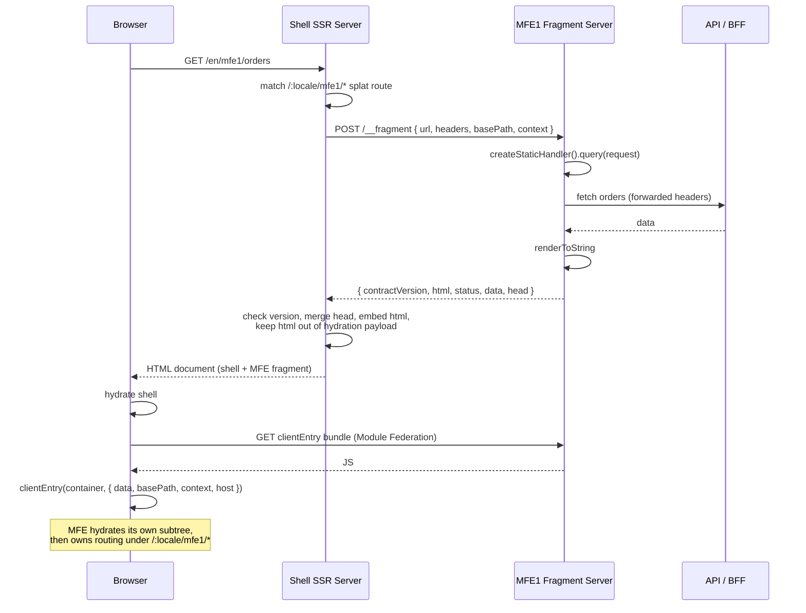

# MFE SSR — Architecture Decision Record

**Date:** 2026-09-16 · **Updated:** 2026-09-25
**Status:** Implemented and verified end-to-end in this repo — server render,
SEO output, fail-soft, browser hydration, locale.
**Router:** React Router — framework mode for the shell, library mode for MFEs.

---

## 1. Summary

A shell application owns the document and is server-rendered for SEO. Each
micro-frontend is an independently deployed service that renders **HTML
fragments** on request. The shell fetches those fragments over HTTP during its
own SSR, embeds them, and after hydration hands each mount point to the MFE's
own client bundle, which takes over routing beneath its mount path.

```
Browser
   │
   ▼
┌─────────────────────────────┐        POST /__fragment
│  Shell (React Router FW)    │ ──────────────────────────►  MFE1 fragment server
│  • owns the document        │ ◄──────────────────────────  FragmentResponse
│  • only SEO-bearing SSR     │        (own process)
│  • /:locale/mfe1/* splat    │
└─────────────────────────────┘ ──────────────────────────►  MFE2, MFE3 …
   │
   │  browser: Module Federation (dependency sharing only)
   ▼
MFE1 clientEntry ── hydrates its own subtree, owns routing under /:locale/mfe1/*
```

**The contract** (`@platform/mfe-contract`, §3):

```
{ url, headers, basePath, context }  →  { contractVersion, html, status, data, head }
```

### What has been verified

| | |
| --- | --- |
| Crawler-visible SSR, index **and** deep links | ✅ raw HTML carries real content |
| MFE `<title>` merged into the shell's `<head>`; MFE 404 becomes the document's 404 | ✅ |
| Loader data resolved server-side, handed to the browser without refetching | ✅ |
| Browser hydration + `loadRemote` + MFE mount, on one shared `react-dom` | ✅ |
| Client-side navigation inside the MFE, back/forward included | ✅ no reload, no fragment refetch |
| Locale in the URL: server render and hydration in the same language; switching refetches | ✅ |
| Contract version mismatch on either half degrades instead of breaking | ✅ |
| Fail-soft: MFE down → client rendering, shell alive, recovers unaided | ✅ |
| Server bundle absent from the public client output | ✅ enforced at build |

---

## 2. Why this architecture

Each decision below was forced by a constraint, not chosen on preference.

### 2.1 Exactly one thing can own the document

An HTML document has one `<html>`, one `<head>`, one hydration lifecycle. That
single fact drives everything else: the shell owns the document, and MFEs
contribute **fragments** into it.

### 2.2 Therefore an MFE is not a document-owning framework

A full SSR framework assumes it is alone on the page: it emits a complete
document, and it hydrates through state it puts on the document. Two of them on
one page contend for both. So an MFE doesn't bring a framework; it brings a
**fragment** and a function to hydrate it. This applies to React Router's own
framework mode too — hence the split in §2.3.

### 2.3 Therefore MFEs use React Router in *library* mode

`createStaticHandler` / `createStaticRouter` / `StaticRouterProvider` exist to
be driven by an arbitrary host: match a URL, run loaders, render to a string.
With `hydrate={false}`, React Router emits no hydration script and no
document-level global; the loader data travels back to the browser as a plain
value in the fragment response, and `clientEntry` receives it as an argument:

```ts
clientEntry(container, { data, basePath, context, host })
```

No shared name, nothing to collide — any number of MFEs can coexist on a page.

### 2.4 Therefore MFEs own their servers, reached over HTTP

The shell never loads an MFE's code into its own process. Each MFE runs a
fragment server; the shell calls it with `fetch`. That makes an MFE failure an
ordinary rejected promise, caught at the call site — never a crash, a leaked
global or cross-request state in the shell. It also means MFE deploys never
restart the shell.

The cost is real — N services to operate, a network hop inside SSR — and that is
the trade this architecture accepts deliberately (§5).

### 2.5 "Owns a server" does not mean "needs a framework"

The MFE's server has one job: accept a `FragmentRequest`, return a
`FragmentResponse`. It is a thin wrapper around `serverEntry` on Node's built-in
`http` — no framework, no application server, no server routes. The fragment
endpoint is designed on purpose, not scraped out of a document.

### 2.6 Module Federation is kept — but only in the browser

Federation is used for one thing: loading each MFE's browser bundle at runtime
and sharing dependencies with it. `react`, `react-dom`, **`react-dom/client`**
and `react-router` are singletons, so the page carries one copy of each.
`react-intl` is shared *without* `singleton`: it keeps all state in its
provider, so one copy serves every app when versions match, and an MFE on an
incompatible version loads its own rather than being forced onto the shell's.
A library holding module-level state — i18next's global instance — must not be
shared at all, or apps would share that state.

`react-dom/client` has to be listed on its own — a subpath isn't covered by its
package's shared entry — and it matters most: it holds React's renderer. With
two renderers on one page, their concurrent renders interleave over the shared
router contexts, and an MFE's `RouterProvider` intermittently sees the shell's
router ("You cannot render a `<Router>` inside another `<Router>`").

Remotes are registered at runtime from a registry the shell's root loader
serialises into the document, never declared at build time — a build-time
`remotes` bakes URLs into the bundle.

### 2.7 The shell is React Router framework mode on rsbuild

With MFEs on React Router library mode, a React Router shell makes
`react-router` a single shared instance across shell and MFEs, and gives the
shell the same routing model its MFEs use.

**On the bundler.** The shell runs on rsbuild with `rsbuild-plugin-react-router`
(pre-1.0, community). `pluginReactRouter({ federation: true })` is not an output
switch — it performs three fixes in rspack's model that browser federation
needs:

| `src/federation.ts` | What it prevents |
| --- | --- |
| `isolateFederationContainerRuntime` | Gives the MF container its own runtime chunk. Sharing one means the app entry's share-scope consumes run before the host initialises the scope — **a second React**. |
| `ensureFederationAsyncStartup` | Force-sets `asyncStartup` on the MF plugin, the async boundary shared consumption needs (§7). |
| `enforceAsyncOnlyServerSplitChunks` | Pins `splitChunks.chunks = 'async'` so initial chunks cannot break rspack's startup gate `__webpack_require__.O`. |

`runtimeChunk`, `splitChunks` and `__webpack_require__.O` have no Vite
counterpart, so a move to React Router's first-party Vite plugin would not port
these fixes — it would trade them for `@module-federation/vite`'s, which are
untested here. Stay on rsbuild until the plugin causes a concrete problem; if
it does, spike the Vite shell in a throwaway directory first.

### 2.8 The locale is in the URL

Every page lives under its locale: `/en/mfe1/about`, `/fr/mfe1/about`. The
shell reads it from the path and hands it to MFEs as `context.locale` on both
halves of the contract; MFEs own their translations.

**Why the URL, and not somewhere else.** This project server-renders for SEO,
and the locale has to satisfy the same two readers everything else does:

1. **The server render and the browser must agree.** The fragment server renders
   in some language; the browser then hydrates that markup and must render the
   same language, or hydration mismatches. So the value has to be known to the
   server on the very first request, and be identical in the browser.
2. **A crawler must be able to reach every language.** Each language version
   needs an address a crawler can request and index on its own.

Only a path segment satisfies both. The alternatives, and why they lose:

| Where the locale lives | Server knows it | Crawlers see each language | Verdict |
| --- | --- | --- | --- |
| **Path: `/fr/...`** | ✅ in the URL | ✅ one URL per language | **Chosen** |
| Query: `?lang=fr` | ✅ | ⚠️ | Google: "URL parameters … Not recommended" |
| Cookie only, same URL | ✅ | ❌ one URL, content varies | Google: "might not find and crawl all your variations" |
| `localStorage` + a JS event | ❌ browser-only | ❌ | Server renders the default, browser renders the choice: a hydration mismatch on every page load for non-default users |
| `Accept-Language` read by each MFE | ✅ | ❌ | Each MFE decides for itself; they can disagree, and the user's explicit choice is ignored |

The Google guidance is *Managing multi-regional and multilingual sites*
(Search Central), which recommends country domains, subdomains or
**subdirectories** (`example.com/de/`, "easy to set up with low maintenance")
and explicitly not URL parameters or content that changes by cookie or browser
setting. Subdirectories are the cheapest of the three and the only one needing
no DNS or hosting changes.

**Why the shell selects it, not the MFE.** One decision, made once per request,
passed explicitly: MFEs never read the locale from headers, cookies or storage.
That keeps every MFE on the page, and both halves of each MFE, on the same
language, and makes it part of the typed, versioned contract (`MfeContext`)
rather than an implicit convention.

**What the cookie is for.** Only remembering the choice: a bare `/` has no
locale in it, so it redirects to the one the picker last set, else `en`. The
cookie never overrides a locale that is in the URL.

**Consequences, accepted:**

- Switching language is a plain navigation (`/en/...` → `/fr/...`), not an
  event anyone subscribes to. The MFE route's `shouldRevalidate` refetches the
  fragment only when the locale segment changes; MFE-internal navigation is
  untouched.
- Every shell route sits under `/:locale`; an unknown prefix (`/zz`) is a 404.
  URLs without a locale (the old `/mfe1`) no longer exist — add redirects if
  they were ever published.
- Language switches are shareable and bookmarkable, and back/forward crosses
  them like any navigation.

**Not done yet:** `hreflang` alternate links in `<head>`, which Google pairs
with per-language URLs so it knows the pages are translations of each other.

**Where this would differ:** pages behind a login have no crawler to serve.
There, a user-profile setting remembered in a cookie is the usual choice and
the URL prefix is optional — the contract doesn't change, only where the shell
reads the locale from.

### 2.9 The theme is CSS, selected by the shell

The shell selects light or dark and sets it on `<html data-theme>`, rendered
by the server from a `theme` cookie. MFEs don't receive it: they style with the
theme tokens (`--theme-bg`, `--theme-fg`, … in `@platform/mfe-contract/theme.css`).

**Why not pass it like the locale.** The locale changes *what* an MFE renders —
its text — so the server render needs it, and it travels in `context`. The
theme changes only *how* it looks, which CSS resolves from the attribute:

- MFE markup is identical in both themes, so hydration can't mismatch and
  fragments don't vary by theme.
- A switch restyles every MFE on the page with no re-render, no navigation and
  no fragment refetch (verified: the MFE's DOM node survives the switch).
- The contract's `context` stays small; the shared surface is the token names,
  versioned with the contract package.

**Why a cookie.** The server has to know the theme to write the attribute into
its HTML; that is what makes the first paint right (verified with JavaScript
disabled). `localStorage` is browser-only: it means a flash of the wrong theme
or a blocking inline script, and the shell's own picker would hydrate in the
wrong state.

**No "follow the OS" mode.** The shell always decides, so the server always
knows. Adding it later is additive: no attribute plus a
`prefers-color-scheme` rule in the tokens — the server can't know the OS
preference on a first request (only Chromium sends it, and only after opting
in), which is why it's CSS-only.

**An MFE that needs the theme in JavaScript** (a canvas chart) reads the
effective value on the client from the attribute and renders neutrally on the
server; it still isn't added to `context`.

---

## 3. The implemented system

### Components

| Project | Role | Ports |
| --- | --- | --- |
| `ssr-shell-rt` | Shell. React Router framework mode on rsbuild. Owns the document and URL space. | 3000 |
| `ssr-mfe` | MFE1. React Router library mode + fragment server. | 3001 browser bundle, 3002 fragment server |
| `csr-mfe` | MFE2. React Router library mode, client-rendered only — no server. | 3003 browser bundle |
| `mfe-contract` | `@platform/mfe-contract` — the shell ↔ MFE contract (types, version check, theme tokens), installed in both. | — |

### MFE endpoints

| Endpoint | Purpose |
| --- | --- |
| `POST /__fragment` | The contract. `FragmentRequest` → `FragmentResponse` |
| `GET /preview/*` | SSR + hydrate preview — the shell's render path without the shell: server markup plus loader data, hydrated by the :3001 bundle (`?locale=` stands in for the shell's choice) |
| `GET /health` | Liveness |

### How each half of the contract is typed

Both halves come from one package, `@platform/mfe-contract` (`mfe-contract/`
in this repo, a `file:` dependency standing in for a registry package). The
contract is the platform's, not MFE1's: every MFE implements the same shape,
and only `data` varies, hence a type parameter. `MfeContext` is the one
versioned slot for what the shell decides per request — `locale` today.

- **Compile time.** The MFE implements the types (`satisfies ClientEntryModule`),
  the shell imports them. A change one side doesn't expect fails that side's
  build.
- **Styles.** `FragmentResponse.head.styles` lists the stylesheets the
  fragment's markup needs, read by the fragment server from its own browser
  build's Module Federation manifest — the build deployed next to it, so the
  names match. The shell links them in the server-rendered `<head>`; without
  them, server-rendered markup is unstyled until the browser bundle loads.
- **Runtime.** Shell and MFEs deploy independently, so compiling against the
  same types says nothing about what is running. Each side reports the
  `CONTRACT_VERSION` it was built against — in `FragmentResponse` and as an
  export of the `clientEntry` module — and the shell checks it before use. A
  mismatched fragment is treated like any failure (client rendering); a
  mismatched browser bundle isn't mounted, leaving server markup static.
  Verified in a browser by bumping each side's version in turn.

Why not MF's generated types: its DTS plugin needs either a build-time
`remotes` declaration, which bakes the URL in (§2.6), or its dev-only runtime
hook (`dynamic-remote-type-hints-plugin`), which fetches types only after a
browser registers the remote — never in CI. And it could only ever cover the
browser half: `/__fragment` is JSON, not a module.

### Request sequence



### Browser integration

How the shell's route (`app/routes/mfe1.tsx`) and `clientEntry` meet:

- **One writer of `window.history`.** Hosted, the MFE routes in a memory router;
  navigation crosses as plain calls — `host.onNavigate` up, `handle.navigate`
  down. The MFE reports only *settled* navigations: while a loader runs, its
  router still holds the previous location.
- **The shell's loader doesn't re-run for MFE navigation.** `shouldRevalidate`
  is false unless the locale changes. Loaders forward React Router's
  normalized `url`, never `request.url`, which carries `.data` on client
  navigations.
- **MFE markup is not React's territory.** The shell renders `#mfe1-root` with
  `dangerouslySetInnerHTML` and `suppressHydrationWarning`; the fragment sits in
  an inner `<div data-mfe-ssr>`, and that is what the MFE hydrates — React
  forbids a root on an element it renders with `dangerouslySetInnerHTML`.
- **MFE roots unmount a tick late.** Route cleanup runs during the shell's
  render, and React can't unmount another root then. Each client mount gets a
  fresh inner element, so a remount never reuses one still being torn down.
- **HTML never enters loader data.** The framework serialises loader data into
  the page; the fragment would ship twice. A token goes through
  `app/mfeHtmlStore.ts` and the markup is read server-side only.

### Client-rendered MFEs

Not every MFE needs SEO. A client-rendered one (MFE2) is built the same way
minus the server half: same contract, same `clientEntry`, same i18n, styling
and theme rules. The shell mounts SSR and CSR MFEs through one component
(`MfeMount`); a CSR route simply has no loader, so it passes no `data` and no
markup — exactly what an SSR MFE gets when its fragment fetch fails. One code
path, tested both ways.

The trade: a CSR MFE's content isn't in the server's HTML, and an unknown path
inside it can't set the document's status (it renders its own not-found under
a 200). Its first loaders run in the browser, behind a `HydrateFallback`.

Verified: empty mount point in the server HTML; mounts and runs its loaders in
the browser; in-MFE navigation, back/forward (with slow loaders), deep links,
locale and theme; switching between MFE1 and MFE2; all shared libraries loaded
once, from the shell.

### Ownership boundary

- **Shell owns** the document, the URL space (including the locale), which path
  each MFE occupies, and `<head>` composition.
- **MFE owns** everything beneath its mount path: routes, navigation, data
  fetching, translations and its own rendering.

`basePath` is passed in rather than hardcoded, so an MFE can be relocated or
mounted more than once without an MFE release.

### Resilience

The shell treats an MFE as a fragment, never as the page:

- Per-MFE timeout via `AbortSignal.timeout` — genuinely cancels the request.
- Any failure, non-2xx or contract mismatch degrades that fragment to
  client-side rendering; the page still renders.
- An MFE's own 404 is a successful render: it comes back as `status` in the
  fragment and becomes the document's status. Only page mounts adopt it; a
  widget mount must not.
- No process-level guard: behind HTTP, a failed fetch is an ordinary rejected
  promise caught at its call site.

**Verified:** with the MFE server down, the page returns 200 with the MFE
rendered client-side, the shell stays alive across repeated requests, and it
recovers automatically when the MFE returns — no restart.

---

## 4. Rules for MFEs

- MFEs contain universal React: code must be SSR-safe.
- MFEs reach backends only through APIs/BFFs — no MFE-owned application server,
  no server routes, no MFE-owned API routes. The fragment server is the only
  server an MFE runs.
- `react`, `react-dom`, `react-dom/client` and `react-router` are shared
  singletons in the browser.
- The contract is explicit: implement `@platform/mfe-contract`, report
  `CONTRACT_VERSION`, take the locale from `context` (a BCP 47 tag).
- Style only with the `--theme-*` tokens; never read or branch on the theme
  in render.
- Tailwind in an MFE: a letters-only class prefix, no preflight, no cascade
  layers (see `ssr-mfe/src/styles.css`). The fragment response names the
  expose's stylesheets in `head.styles`, so the host links them before paint.
- Translations: react-intl is the platform default (shared, one copy on the
  page). Whatever the library, one instance per render, initialised from
  `context.locale` — no global instance, no language detection.
- **No mutable module-scope state in server code.** The fragment server handles
  many requests in one process, so module-level mutable state leaks across
  users.

---

## 5. Accepted trade-offs

- **Operational cost.** N services to deploy, monitor, scale and secure. This is
  the price of the isolation in §2.4.
- **Latency inside SSR.** Each fragment is a network round trip. Mitigated by
  per-MFE timeouts; parallelise when a page carries several MFEs.
- **A wasted render on client navigation into an MFE.** The shell's loader
  fetches the full fragment, but only its `data` reaches the browser; the HTML
  is discarded. A data-only fragment mode would remove it if it ever matters.
- **Server-side dependency sharing does not exist** and is not needed — the
  server boundary is a serialized string, so instance identity never matters.

---

## 6. Known gaps

1. **Version skew within one MFE.** Shell ↔ MFE skew is handled by the contract
   version check (§3). Still open: a deploy can leave one MFE's fragment server
   on one release while browsers load its previous client bundle — same
   contract major, different markup. Needs a deliberate strategy.
2. **`validate:mfe` is unbuilt.** Should cover: no mutable module-scope state
   (a concurrency smoke test catches the realistic cases), no global mutation,
   SSR safety, and pinned versions.
3. **`hreflang` links** for the per-language URLs (§2.8).
4. **The shell's bundler.** Staying on rsbuild is a deliberate choice — §2.7
   sets out what a move to Vite would involve and what remains untested.

---

## 7. Operating notes

Node ≥ 22.22 (React Router 8); both projects pin 24.21.0 via `.nvmrc`.

```sh
cd ssr-mfe      && nvm use && npm run dev   # 3001 browser, 3002 fragment server
cd ssr-shell-rt && nvm use && npm run dev   # 3000
```

The landmines — each with its symptom and fix — live in `CLAUDE.md`. The
configuration they produced:

- `experiments: { asyncStartup: true }` on the **Module Federation plugin** in
  both projects, not on rsbuild's top-level `experiments`. Without it the
  browser dies at startup with `RUNTIME-006: Invalid loadShareSync`.
- `pluginReactRouter({ federation: true })` stays on (§2.7).
- `federation: true` also copies the whole server build into
  `build/client/static`; `scripts/strip-server-copy.mjs` removes it after every
  build and fails if any file in `build/client` still hashes to the server
  bundle.
- `NODE_OPTIONS=--experimental-vm-modules` is required by **rsbuild's dev
  runner** for ESM server bundles, not by Module Federation.
- The browser remote is loaded with `loadRemote('mfe1/clientEntry')` from
  `@module-federation/enhanced/runtime`, not a bare `import()`: the specifier
  is a runtime string, so the server compilation has nothing to resolve.
- Route modules take their arg types from the generated `./+types/<route>`;
  `@react-router/dev`'s typegen imports Vite, so `vite` is a devDependency even
  under rsbuild.

---

## 8. References

- [`rsbuild-plugin-react-router`](https://github.com/rstackjs/rsbuild-plugin-react-router) — community-maintained
- [`@module-federation/rsbuild-plugin`](https://www.npmjs.com/package/@module-federation/rsbuild-plugin) · [MF Rsbuild guide](https://module-federation.io/guide/build-plugins/plugins-rsbuild)
- [Google Search Central — Managing multi-regional and multilingual sites](https://developers.google.com/search/docs/specialty/international/managing-multi-regional-sites)
- Repo: `ssr-shell-rt/` (shell), `ssr-mfe/` (MFE1 + fragment server), `mfe-contract/` (contract)
