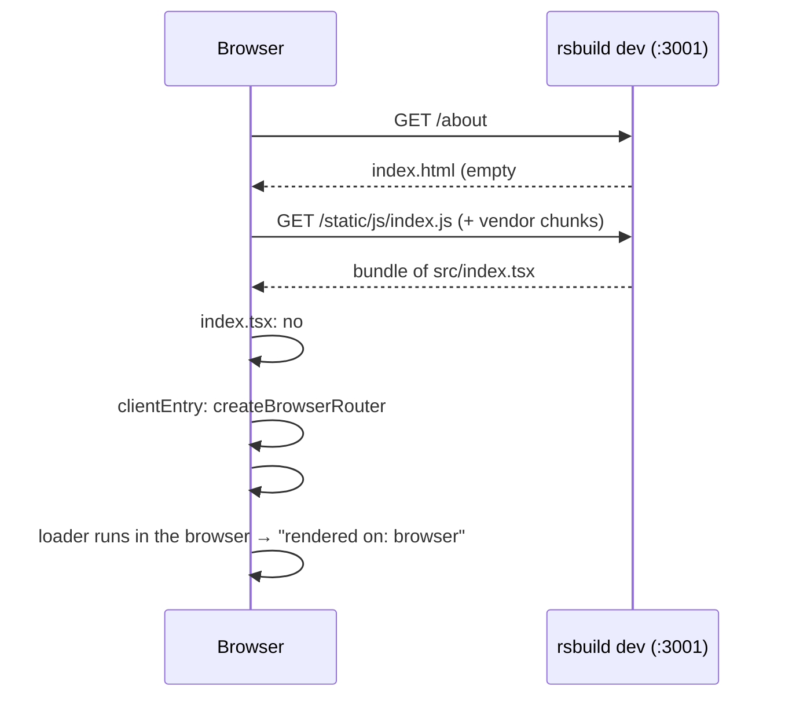
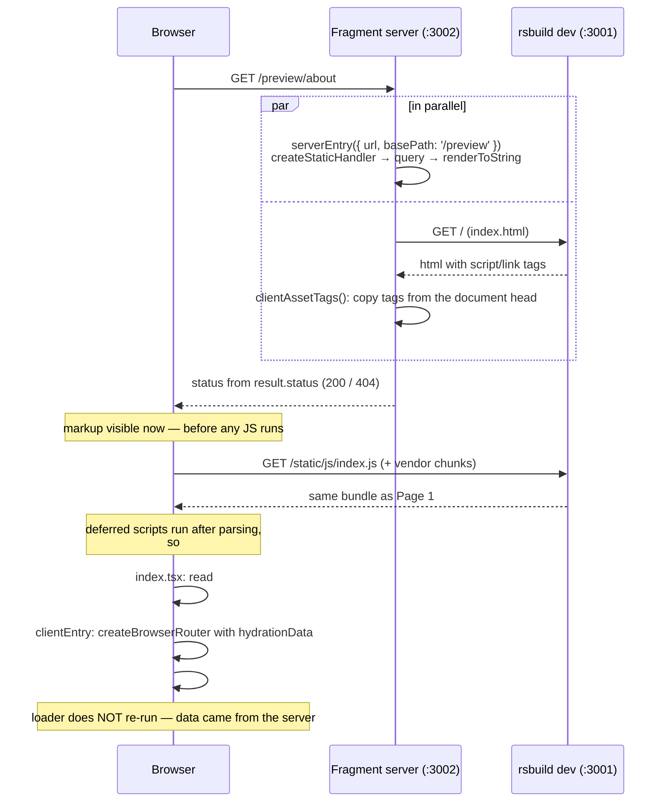
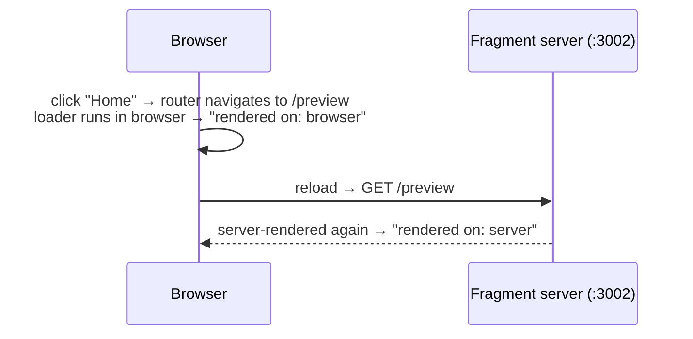

# MFE Standalone Mode

**For:** MFE developers working without the shell.
**Companion to:** `render-and-hydration-flow.md` (the same flow *with* the
shell).

---

## The one-line version

`npm run dev` in `ssr-mfe/` gives two dev pages. **:3001** renders in the
browser only — the fast loop. **:3002/preview** renders on the server and then
hydrates, the same path the shell takes. Both mount through the same
`clientEntry`.

| Page | Server render | Hydration | Router | basePath |
| --- | --- | --- | --- | --- |
| `:3001/*` | No — empty `#root` | No — `createRoot` | browser | `''` |
| `:3002/preview/*` | Yes — `serverEntry` | Yes — `hydrateRoot` | browser | `/preview` |
| Shell `:3000/:locale/mfe1/*` | Yes — `serverEntry` via `/__fragment` | Yes — `hydrateRoot` | memory (`host` set) | `/en/mfe1`, `/fr/mfe1` |

---

## Page 1 — `:3001`, client-only

`rsbuild dev` serves a generated `index.html` with an empty `#root`. Nothing
MFE-specific happens on the server.

---

## Page 2 — `:3002/preview`, server render + hydrate

The fragment server renders the page itself and borrows the browser bundle
from :3001.

### Navigating after hydration

---

## What each file does

| File | Role in standalone mode |
| --- | --- |
| `ssr-mfe/src/server.ts` | `/preview/*`: calls `serverEntry`, embeds `{ data, basePath }` in `#mfe-preview`, copies :3001's script tags. |
| `ssr-mfe/src/index.tsx` | Browser entry for both pages. `#mfe-preview` present → pass its data; absent → `{ basePath: '' }`. |
| `ssr-mfe/src/clientEntry.tsx` | Unchanged. `hydrateRoot` if `#root` has children, `createRoot` otherwise. |
| `ssr-mfe/src/serverEntry.tsx` | Unchanged. Same function the shell calls through `/__fragment`. |

---

## What standalone mode does not cover

Only the shell exercises these:

- **`loadRemote("mfe1/clientEntry")`** — standalone imports `clientEntry`
  directly from its own bundle; Module Federation's remote loading is skipped.
- **Hosted mode** — no `host` is passed, so the MFE runs a browser router and
  owns `window.history`. Under the shell it runs a memory router and reports
  navigation through `host.onNavigate`.
- **Request headers** — the preview forwards none; the shell forwards all of
  them. A loader that depends on a cookie renders logged-out in the preview.
- **Document status policy** — the preview returns `status` directly; in the
  shell only the page mount adopts it.

If :3001 is not running, `/preview` still renders the server markup, with a
note that hydration is off.

Both pages stand in for the shell's locale choice with `?locale=` (default
`en`): `:3001/about?locale=fr`, `:3002/preview/about?locale=fr`.
