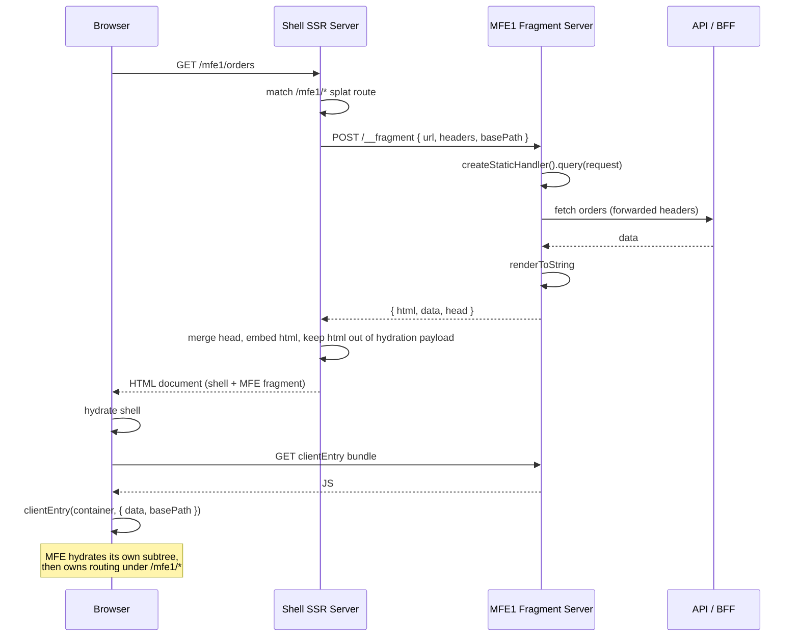

# Variant — Each SSR MFE Owns Its Server

**Date:** 2026-09-16
**Status:** Design variant. Not implemented; the PoC uses in-process federation.
**Related:** `mfe-ssr-poc-synthesis.md` (what was built and tested),
`tanstack-start-mfe-ssr-architecture.md` (target architecture).

---

## The change in one line

The **contract stays identical**. Only the **transport** changes: instead of the
shell loading MFE code into its own process and calling a function, the shell
makes an HTTP request to a small MFE-owned service.

```
{ url, headers, basePath }  →  { html, data, head }
```

Today that is a function call. In this variant it is a `fetch`. Everything the
shell does either side of that line — splat route, head merge, HTML store,
timeout, fail-soft, mount div, client entry — is unchanged.

---

## Sequence



If the MFE server is slow or down, the shell abandons the call at its timeout
and renders an empty mount div. The MFE then mounts client-side instead — the
same degradation path already built and tested.

---

## What it fixes

Every one of these is a problem the PoC actually hit, not a hypothetical.

| Problem encountered in the PoC | Resolved by per-MFE servers |
| --- | --- |
| MF plugin rewrote the shell's chunk loading and broke every route | ✅ No server-side federation at all |
| TanStack Router could not SSR standalone | ✅ MFE drives its own rendering behind its own server |
| MF runtime's floating promise crashed the shell process | ✅ A failed `fetch` is an ordinary rejected promise |
| MFE code executing in the shell's process: shared globals, module-scope state across requests, shared memory, crash blast radius | ✅ **Real process isolation** |
| `--experimental-vm-modules` required | ✅ No `vm` evaluation of remote code |
| MFE's node build needed a static file server, `assetPrefix`, `writeToDisk` | ✅ No node federation build exists |
| Server-side singleton sharing never actually worked | ✅ Moot |
| Unclear when a running shell picks up a redeployed MFE | ✅ Each request reaches the MFE's current deployment |

They share one root cause: **executing another team's code inside your server
process**. Remove that and they disappear together.

A secondary consequence: without server-side federation, the rspack requirement
lifts, so Vite becomes viable and the `rsbuild-plugin-react-router` dependency
(pre-1.0, experimental federation) is no longer forced.

---

## What it costs

- **Operational.** N services to deploy, monitor, scale, secure and keep alive.
  This is the real price and it is not small.
- **Latency in the SSR critical path.** Every MFE render becomes a network
  round trip. With several MFEs per page you need parallel fetching plus the
  per-MFE timeout already implemented.
- **New failure modes.** Network partitions, timeouts, cascading failures —
  different from today's, not necessarily fewer.
- **Contradicts three stated benefits** of the current architecture doc: one SSR
  server, no route-level reverse proxy, no server per MFE.

---

## Framework choice under this model

### "Owns a server" does not mean "needs a framework"

The MFE's server has exactly one job: accept a request, return
`{ html, data, head }`. The function that does this already exists — the server
is a thin HTTP wrapper around it:

```ts
// MFE1's server — a transport, not a framework
server.post('/__fragment', async (req) => {
  const { url, headers, basePath } = await req.json()
  return Response.json(await serverEntry({ url, headers, basePath }))
})
```

So the MFE stays **React Router library mode** plus ~20 lines of HTTP. This is
*simpler* than the current setup, not more complex.

It also removes the "a full framework emits whole documents, so you would have
to scrape HTML out of them" objection — you design a fragment endpoint on
purpose rather than parsing a page.

### MFE: still React Router library mode

Two objections to a full framework inside an MFE survive even with a server:

- **Fragment output fights the framework.** TanStack Start wraps output in
  `<!DOCTYPE html>` and injects hydration scripts before `</body>`. React Router
  lets you own `entry.server.tsx` and call the render yourself, so fragments are
  natural there — but library mode is more natural still.
- **The hydration-global collision is a browser problem, and servers do not
  change the browser.** Any framework that owns document-level hydration assumes
  it is alone on the page (Start's `$_TSR` is hardcoded and self-deleting).
  Library mode sidesteps this structurally: `hydrationData` is passed
  explicitly, no global involved.

### Shell: genuinely reopens

Without server-side MF the rspack constraint lifts, so both become viable:

- **TanStack Start on Vite** — its primary, mature path, rather than the newer
  rsbuild path this PoC struggled with.
- **React Router framework mode on Vite** — first-party tooling, community
  plugin risk removed.

A real toss-up, decided on ecosystem preference rather than technical blockers.
The remaining asymmetry: if MFEs are React Router library mode, a React Router
shell makes `react-router` a genuine shared singleton across shell and MFEs.
With Start you ship two router libraries and cannot dedupe them.

---

## Migration effort from what exists today

Small, because the contract does not move.

| Side | Change |
| --- | --- |
| MFE | Add an HTTP wrapper exposing `serverEntry` at a fragment endpoint. Keep `serverEntry`/`clientEntry` exactly as-is. Drop the node federation build and its static file server. |
| Shell | Replace `await serverEntry(input)` with `await fetch(...)`. Drop the node-side MF plugin. Keep the splat route, HTML store, timeout, fail-soft, mount and client entry untouched. |

The client side can keep Module Federation for dependency sharing, or drop it
and load each MFE's client bundle directly — at the cost of shipping React more
than once.

---

## When to choose it

**Choose per-MFE servers if** the organisation already runs many services with
solid platform tooling, and independent deployability and team isolation matter
more than operating a single runtime. This is the mainstream micro-frontend
pattern, for precisely the reasons in the table above.

**Keep in-process federation if** avoiding N services was a genuine goal. What
the PoC built is a legitimate answer to "SSR MFEs without extra infrastructure"
— it works, and its fragility is now documented rather than unknown.

**The framing for the decision:** in-process federation trades operational
simplicity for runtime fragility; per-MFE servers trade the reverse. Both
deliver SSR and SEO equally well.
