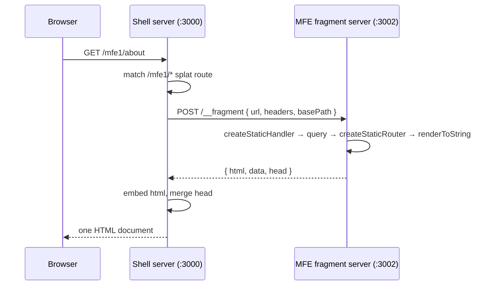

# Render & Hydration Flow

**For:** developers working on the shell or an MFE.
**Companion to:** `mfe-ssr-decision-record.md` (which explains *why* it is built
this way; this explains *how it runs*).

---

## The one-line version

**Each app renders its own HTML.** The MFE's server renders the MFE; the shell's
server renders the document and embeds the MFE's markup. In the browser, each
app hydrates its own part.

The shell never renders MFE components, and the MFE never knows what document
it ends up in.

---

## Part 1 — Server render

Two servers are involved in one page request.



### What the MFE's server does

```ts
const handler = createStaticHandler(routes, { basename: basePath })
const context = await handler.query(request)
const router  = createStaticRouter(handler.dataRoutes, context)
const html    = renderToString(
  <StaticRouterProvider router={router} context={context} hydrate={false} />,
)
```

| Step | What it does |
| --- | --- |
| `createStaticHandler(routes)` | Builds the routing **brain**: knows the route table, can match a URL and run loaders. No React involved. |
| `handler.query(request)` | Does the work — matches the URL, runs the matching loaders, returns a `context` with loader data, matched routes and status. |
| `createStaticRouter(...)` | Packages that result into the shape React expects, so `useLoaderData()`, `<Link>` and `<Outlet>` work. Frozen: one moment, no navigation. |
| `renderToString(...)` | **React DOM's** job, not React Router's — turns the component tree into an HTML string. |

> **Why "static"?** On the server there is one request and one render; nothing
> navigates. `createBrowserRouter` in the browser is the live counterpart.

**`hydrate={false}`** suppresses React Router's own
`window.__staticRouterHydrationData` script. Loader data travels back in the
`data` field instead, so nothing depends on a document-level global — which is
what lets several MFEs share one page.

### What the shell's server does

Its splat route calls the fragment endpoint, then embeds the result:

```tsx
// app/routes/mfe1.tsx
const result = await fetchFragment(MFE1_FRAGMENT_URL, { url, headers, basePath })

return {
  data:      result.data,          // → handed to clientEntry later
  head:      result.head,          // → merged into <head> via meta()
  htmlToken: putHtml(result.html), // → NOT the html itself
}
```

The HTML goes into a short-lived server-side store and only a **token** enters
loader data. Loader data is serialised into the page for hydration, so putting
the markup there would ship the whole fragment twice.

---

## Part 2 — What the browser receives

One ordinary HTML document. The MFE's markup is already inside it, which is why
a crawler with no JavaScript sees real content:

```html
<div id="mfe1-root">
  <div style="border:2px dashed #999…">
    <strong>MFE1</strong> …
    <p>Hello from MFE1.</p>
    <small>rendered on: <strong>server</strong> · fetched at …</small>
  </div>
</div>
```

Plus the MFE's `<title>`, merged into the shell's `<head>`.

---

## Part 3 — Client hydration

There are **two** React roots, and they come alive in order.

```mermaid
sequenceDiagram
    participant E as entry.client.tsx (generated)
    participant R as Shell route mfe1.tsx
    participant C as MFE clientEntry.tsx

    E->>E: hydrateRoot(document, <HydratedRouter/>)
    Note over E: shell alive; its React skips #mfe1-root
    E->>R: render → effects run
    R->>R: loadRemote('mfe1/clientEntry')
    R->>C: clientEntry(container, { data, basePath })
    C->>C: hydrateRoot(container, <RouterProvider/>)
    Note over C: MFE alive; owns routing under /mfe1/*
```

### 1. The shell hydrates itself

```js
// generated by rsbuild-plugin-react-router — not in this repo
hydrateRoot(document, <StrictMode><HydratedRouter /></StrictMode>)
```

It hydrates **`document`** — framework mode owns the whole page. You can eject
this by creating `app/entry.client.tsx`, but there is no reason to.

### 2. The shell hands over the mount point

```tsx
useEffect(() => {
  const mod = await loadRemote<Mfe1ClientEntry>('mfe1/clientEntry')
  mod.clientEntry(container, { data: initial?.data, basePath: MFE1_BASE })
}, [initial])
```

Effects run after the hydration render, so the shell is always fully hydrated
before this fires.

### 3. The MFE hydrates its subtree

```tsx
// ssr-mfe/src/clientEntry.tsx
const router = createBrowserRouter(routes, {
  basename: input.basePath,
  hydrationData: input.data ? { loaderData: input.data } : undefined,
})

if (container.hasChildNodes()) {
  hydrateRoot(container, <RouterProvider router={router} />)   // markup exists
} else {
  createRoot(container).render(<RouterProvider router={router} />)  // SSR failed
}
```

| Piece | Why |
| --- | --- |
| `createBrowserRouter` | The **live** router — listens to history, re-renders on navigation. Makes in-MFE links instant. |
| `basename` | Told by the shell, so `<Link to="/about">` produces `/mfe1/about`. |
| `hydrationData` | "The server already fetched this." Without it the loader re-runs — a wasted request plus a flash of dataless UI. |
| `hasChildNodes()` branch | Hydrate existing markup, or mount fresh when the shell's fragment fetch failed. |

---

## The no-touch boundary

The shell hydrates `document`, which **contains** the MFE's markup. The shell's
React has no components matching that markup, so it must leave it alone —
otherwise it would wipe content that step 3 is about to claim.

That is what this does:

```tsx
<div
  id="mfe1-root"
  suppressHydrationWarning
  dangerouslySetInnerHTML={{ __html: ssrHtml ?? '' }}
/>
```

On the server `ssrHtml` holds the fragment. On the client it is `undefined`, and
React does not write `innerHTML` during hydration — so the server markup
survives. `suppressHydrationWarning` silences the dev-only notice about that
deliberate difference.

---

## Where every piece lives

| File | Role | Written by |
| --- | --- | --- |
| `ssr-mfe/src/routes.tsx` | Route table + loaders. Shared by both entries. | you |
| `ssr-mfe/src/serverEntry.tsx` | Renders the fragment. | you |
| `ssr-mfe/src/server.ts` | HTTP wrapper — `POST /__fragment`. | you |
| `ssr-mfe/src/clientEntry.tsx` | Builds the live router, hydrates or mounts. | you |
| `ssr-mfe/src/index.tsx` | Standalone dev entry (`:3001`), same `clientEntry`. | you |
| `ssr-shell-rt/app/routes/mfe1.tsx` | Fetches fragment, embeds it, hands over the mount. | you |
| `ssr-shell-rt/app/mfeHtmlStore.ts` | Keeps the markup out of loader data. | you |
| `ssr-shell-rt/app/mfeRegistry.ts` | Registers remote URLs at runtime. | you |
| `entry.client.tsx` | `hydrateRoot(document, …)` — shell hydration. | **plugin** |
| `entry.server.tsx` | Streams the shell's document. | **plugin** |

---

## Summary

- **Two renders on the server** — the MFE renders itself; the shell renders the
  document and embeds the result.
- **Two hydrations in the browser** — the shell hydrates `document`, then hands
  one `<div>` to the MFE, which hydrates that subtree.
- **The boundary is a string.** No MFE code runs in the shell's process; no
  React instance is shared across the server boundary.
- **Same routes, both sides.** The server builds them once and freezes them;
  `clientEntry` picks them up and brings them to life.
